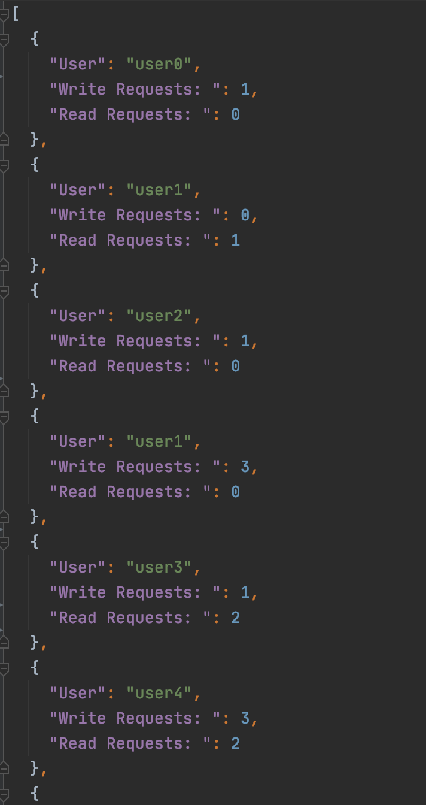

# Homework 3: Simulation of Chord Algorithm using Akka
## Overview: 
In this project, we have implemented Chord algorithm using Akka, an actor-based computational model, to simulate a distributed hash table with a virtual overlay network for distribution of work in a cloud data center.

## Team Members:
* Rahul Romil Keswani
* Snehal Tikare (Team Leader)
* Sakina Yusuf Master

## Development Environment:
* Language: Scala v2.12.12
* IDE: IntelliJ IDEA
* Build Tool: SBT v1.3.9
* Framework Used: Akka 2.6.10 and Akka HTTP 10.2.0

## Steps to run:
* Clone this repository and navigate to the directory it’s been stored in
* To run the application, enter the command: 
```
sbt clean compile run 
```
* To run the test files, enter the command:  
```
sbt clean compile test
```

## Code Structure and Flow:
## Actor package:  
The Actor package consists of two types of actors used in the system.  
## Server Actor:  
This class represents each server/node in the Chord ring. Each node in our Chord is an actor and the state of these nodes change as new nodes join. The node is created with state variables such as successor, predecessor, and finger table. All these variables have a node reference to self initially.   

The main messages defined on this actor are as follows:    

* **joinRing:** With the help of an existing node a new node is able to updates its state behaviors such as finger table, predecessor and successor. The case class find_predecessor is used to achieve this. Once its state is updated, it calls the method notifyOthers(), which notifies other nodes to update their finger table to accommodate the new node. The case class updateFingerTables is used to accomplish this.    

* **chordGlobalState:** It is used to display the global state of the application listing the node id, successor, predecessor and finger table for all the nodes as JsonObject.  

* **find_predecessor:** It recursively finds the predecessor and the successor of the node that is just added, and it uses the case class closestPrecedingFinger to accomplish this.  

* **searchNodeToWrite:** When a random node gets the input request to write data, it determines if it or its successors are the node’s where the data is to be stored. If that is not the case, then it routes the request to the closest preceding finger to the node whose hash id is closest to the key’s hash.  

* **writeDataToNode:** This class writes the unit of data to the node which is responsible for maintain the data. If the data key previously exists at the node, then the value of the key is updated.  

* **getDataFromNode:** This case class is similar to searchNodeToWrite, where a random node gets the hashed input key and this node determines if it contains that key. If that is not the case, then it routes the request to the closest preceding finger to the node whose hash id is greater and is closest to the key’s hash. If the key is still not found, then it sends the message of "Movie not found."  

## User Actor: 
This class depicts a user who queries a database that is hosted in a data center. It has two state variables: readReq and writeReq. 

The main messages defined on this actor are as follows:

* **Read:** It makes read requests to the Akka based Web service and sends the key(movie title) in its parameter  

* **Write:** It makes write requests to the Akka based Web service and sends the key(movie title) and value(movie rating) in its parameter  

## Utils package:  
## Simulation Utils: 
The Simulation object has various methods which are used to simulate the Chord Algorithm and generate user requests for read and write operations.
* **createChordRing:** This method creates all the nodes in the chord ring as Server Actors. The number of nodes to be created is specified in the application.conf file. A reference to all the actor nodes created is stored globally. Once they are created, the nodes are added to the chord ring by using joinRing() message of ServerActor.  

* **createUsers:** This method creates User Actors. The number of user actors to be created is specified in application.conf file.

* **getRandomNode:** It returns a randomly chosen node from the list of created nodes.  

* **getRandomUser:** It returns a randomly chosen user from the list of created users.

* **generateRequests:** The user requests for read and write operations are generated in this function. The number of requests is picked at random between the range of minimum and maximum number specified in config file. These requests are requested by a user which is picked at random. The type of request(read/write) and the data is determined dynamically as well. These requests are then sent via ask pattern to Read/Write messages of User Actor class.

* **getGlobalState:** This method gets the global state of all the nodes in the chord and generates an output file output/ChordGlobalState.json

* **getUserGlobalState:** This method gets the global state of all users and generates an output file called output/UserGlobalState.json  

## Data Utils:
This class is used to generate the random data which is needed for simulating random user requests of read and write operations. It has methods to read the IMDB-Movie-Data.csv file from the resources folder. It also has methods to gets the data from the chord and to store the data on the chord. It does this by sending appropiate messages to the Server Actor which is randomly selected.

## Common Utils:
This class has methods to generate hashed value for nodes and keys using SHA1 algorithm. It has methods to generate random values for node ids when they are created. It also has a boolean checkrange() which determines if the value is between the range which is provided.  

## Server: 
Server class is built using Akka Http dependency. It routes the requests by the users to the nodes and the response from the nodes to the users.

## Results:  
**Part of a simulation:**  
  

**Part of a ChordGlobalState:**  
 

**Part of a UserGlobalState:**  
 

