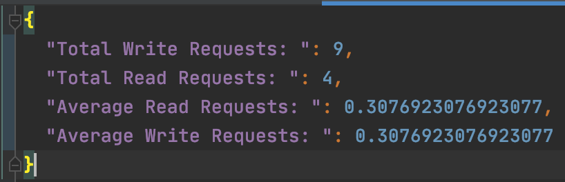

# Course Project: Simulation of the Chord and CAN Algorithm using Akka
## Overview: 
In this project, we have implemented the Chord and CAN algorithm using Akka, an actor-based computational model, to simulate a distributed hash table with a virtual overlay network for distribution of work in a cloud data center.
The project is deployed on AWS using a Docker image.The instructions for which can be found at  [Part-1](https://youtu.be/mAGU4rDkoHE) and 
[Part-2](https://youtu.be/qAdJ1JGcTEo) videos on YouTube.

We use REST API to send requests to server for adding and reading the data across the over lay network.
## Team Members:
* Rahul Romil Keswani
* Snehal Tikare (Team Leader)
* Sakina Yusuf Master

## Development Environment:
* Language: Scala v2.12.12
* IDE: IntelliJ IDEA 20.2.3
* Build Tool: SBT v1.3.9
* Framework Used: Akka 2.6.10 and Akka HTTP 10.2.0

## Steps to run:
* Clone this repository and navigate to the directory it’s been stored in
* To run the application, enter the command: 
```
sbt clean compile run 
```
* To run the test files, enter the command:  
```
sbt clean compile test
```

Note - If the cloned repository throws 'Class not found exception' after building the project.Create a sbt task and run the task.

* To create the sbt task, go to run -> edit configuration -> click on '+' and select 'sbt task'
* Name the task and choose the classpath
* run the created sbt task

## Docker:  
* To create an assembly jar file, enter the command:
```
sbt assembly
```  
* The docker image is built from the created assembly jar file and pushed to and is hosted on Docker Hub with id:
```
sakinamaster/final_project:initial  
```  
* To pull this docker image, enter the command:  
```
docker pull sakinamaster/final_project:initial
```  
* To run this docker image: enter the command:  
```
docker run -i sakinamaster/final_project:initial  
```  
* A sample showing how to pull the docker image and run:  
 

## Code Structure and Flow:
## Chord Implementation: 
This package implements [Chord: A Scalable Peer-to-peer Lookup Service for Internet Applications](https://pdos.csail.mit.edu/papers/chord:sigcomm01/chord_sigcomm.pdf)
The actors are sharded in the clusters. Each actor represents an Entity in a Shard.There is a single Shard region with multiple shards.
Actors communicate via Envelopes using the Entity ID. The Shard ID on which the actor resides is extracted from entity ID.
## Actor package:  
The Actor package is in com.Chord.Actors. It consists of two types of actors used in the system.

## Server Actor:  
This class represents each server/node in the Chord ring. Each node in our Chord is an actor and the state of these nodes change as new nodes join. The node is created with state variables such as successor, predecessor, and finger table. All these variables have a node reference to self initially.   

The main messages defined on this actor are as follows:    

* **joinRing:** With the help of an existing node a new node is able to updates its state behaviors such as finger table, predecessor and successor. The case class find_predecessor is used to achieve this. Once its state is updated, it calls the method notifyOthers(), which notifies other nodes to update their finger table to accommodate the new node. The case class updateFingerTables is used to accomplish this.    

* **chordGlobalState:** It is used to display the global state of the application listing the node id, successor, predecessor and finger table for all the nodes as JsonObject.  

* **find_predecessor:** It recursively finds the predecessor and the successor of the node that is just added, and it uses the case class closestPrecedingFinger to accomplish this.  

* **searchNodeToWrite:** When a random node gets the input request to write data, it determines if it or its successors are the node’s where the data is to be stored. If that is not the case, then it routes the request to the closest preceding finger to the node whose hash id is closest to the key’s hash.  

* **writeDataToNode:** This class writes the unit of data to the node which is responsible for maintain the data. If the data key previously exists at the node, then the value of the key is updated.  

* **getDataFromNode:** This case class is similar to searchNodeToWrite, where a random node gets the hashed input key and this node determines if it contains that key. If that is not the case, then it routes the request to the closest preceding finger to the node whose hash id is greater and is closest to the key’s hash. If the key is still not found, then it sends the message of "Movie not found."  

## User Actor: 
This class depicts a user who queries a database that is hosted in a data center. It has two state variables: readReq and writeReq. 
The user actors uses Akka Http to invoke methods using the endpoints exposed by the server.

The main messages defined on this actor are as follows:

* **Read:** It makes read requests to the Akka based Web service and sends the key(movie title) in its parameter  

* **Write:** It makes write requests to the Akka based Web service and sends the key(movie title) and value(movie rating) in its parameter  

## Utils package:  
## Simulation Utils: 
The Simulation object has various methods which are used to simulate the Chord Algorithm and generate user requests for read and write operations.
* **createChordRing:** This method creates all the nodes in the chord ring as Server com.CHORD.Actors. The number of nodes to be created is specified in the application.conf file. A reference to all the actor nodes created is stored globally. Once they are created, the nodes are added to the chord ring by using joinRing() message of ServerActor.  

* **createUsers:** This method creates User com.CHORD.Actors. The number of user actors to be created is specified in application.conf file.

* **getRandomNode:** It returns a randomly chosen node from the list of created nodes.  

* **getRandomUser:** It returns a randomly chosen user from the list of created users.

* **generateRequests:** The user requests for read and write operations are generated in this function. The number of requests is picked at random between the range of minimum and maximum number specified in config file. These requests are requested by a user which is picked at random. The type of request(read/write) and the data is determined dynamically as well. These requests are then sent via ask pattern to Read/Write messages of User Actor class.

* **getGlobalState:** This method gets the global state of all the nodes in the chord and generates an output file output/ChordGlobalState.json

* **getUserGlobalState:** This method gets the global state of all users and generates an output file called output/UserGlobalState.json  

## Data Utils:
This class is used to generate the random data which is needed for simulating random user requests of read and write operations. It has methods to read the IMDB-Movie-Data.csv file from the resources folder. It also has methods to gets the data from the chord and to store the data on the chord. It does this by sending appropiate messages to the Server Actor which is randomly selected.

## Common Utils:
This class has methods to generate hashed value for nodes and keys using SHA1 algorithm. It has methods to generate random values for node ids when they are created. It also has a boolean checkrange() which determines if the value is between the range which is provided.  

## Server: 
Server class is built using Akka Http dependency. It routes the requests by the users to the nodes and the response from the nodes to the users.

## CAN Implementation: 
In this package, we implement the [Content Addresseable Network (CAN)](https://people.eecs.berkeley.edu/~sylvia/papers/cans.pdf)
The CAN algorithm uses a d-dimensional space to allocate zones for nodes.We have considered a 2D space and assigned zones to a node based on their coordinates.

## com.CAN.Actors.NodeActor
This class represents each entity in a shard in a cluster.There is a single cluster and multiple shard region.
Each shard has multiple actors, and the state of these nodes change as new nodes join. Each of these are set to a specific co-ordinate as they join. 
The neighbor tables for each are updated as there are additions and removals of nodes.When a node leaves the network, the data stored at that node is transferred to the node which occupies the zone previously occupied by the failed node.  

The main messages defined on this actor are as follows:    

* **setCoordinates:** The coordinate region is set for the node as they join.Initially, random coordinates are assigned to nodes. Using a Bootstrap node, a random node already in the network is used to assign a zone to the newly joined node.
The zone where the coordinates of the newly arrived node lies, is split either horizontally or vertically and one of the split zone is assigned to newly joined node.
* **addData** : Writes data to node in the CAN implementation  
* **joinNode:**  Nodes are added here to the cluster once their co-ordinates and neighbor table is determined.   
* **findZone** : This determines if a node to be added lies within the zone/region of the other node. 
* **addNeighbor** : This message invokes the logic to add a neighbor to a set of nodes  
* **removeNeighbor** : This message invokes the logic to remove a neighbor from a set of nodes  
* **findData** : Checks if a requested data is in a particular node, else it is forwarded to it's neighbor and so on.   
* **leaveNode** : Node is removed from the CAN network using this message. The region of the selected node is then merged to some other suitable node.   
* **updateNeighbors** : The neighbor table for the nodes neighbors are updated.   

## Helper.Bootstrap

This class maintains a list of all nodes added to the system. It is responsible for providing with a random node during initialization of new node. 

## Helper.Coordinate

This class is used by each node to maintain the state of its position in the zone and their centers. It also contains methods to split a zone, merge a zone, check if a node falls into a specific zone, and to check if a node is a neighbor of any other node. 

## Results:  
**Part of Chord simulation:**  
  

**Part of CAN simulation:**


**Part of a ChordGlobalState:**  
The below screenshot captures the snapshot of the state of nodes in the chord ring.It captures the details like successor, predecessor and finger-table at the given moment.
 

## Analysis
**Part of Global Requests state of Chord:** 
The below screenshot captures the snapshot of the state of the requests. It captures the number of write and read requests made by each user in the Chord implementation.
 

**Part of Global Requests state of CAN:** 
The below screenshot captures the snapshot of the state of the requests. It captures the number of write and read requests made by each user in the CAN implementation.
 

* Both the algorithms were simulated based on certain pre-defined parameters like Number of nodes, number of read requests to be served per minute.
The simulations were run for various configuration of these parameters.The above image shows state of the simulation at given instance of time.
The Chord algorithm took approx, 2 minutes to create the network of 3 nodes and satisfy 13 requests generated during the time of simulation
where as the CAN implementation took  approx 1 minute to create a network of 3 nodes and satisfy 12 requests generated during the time of simulation.
#### Chord Protocol
* The average number of read requests completed per simulation - 0.30
* The average number of write requests completed per simulation - 0.30

#### CAN Protocol
* The average number of read requests completed per simulation - 0.58
* The average number of write requests completed per simulation - 0.41

Thus, overall CAN performs better than Chord.

## Future Work
* The current implementation does not handle node leave or failure in Chord
* The current implementaion of CAN handles only single node failure, next to step would be to handle multiple node failure.


